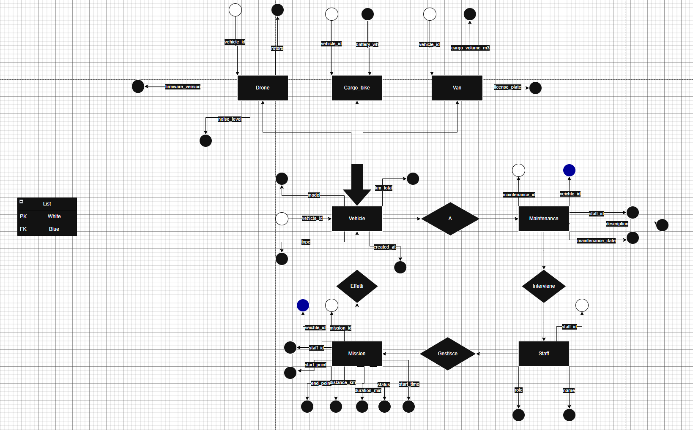
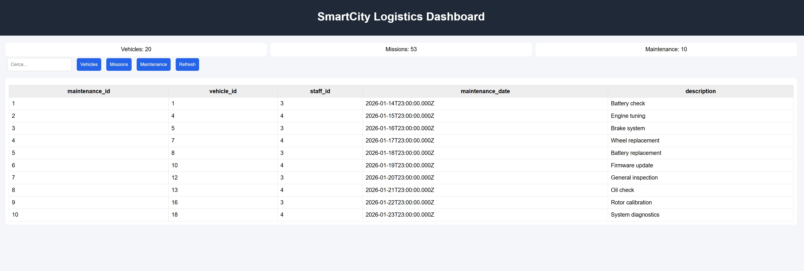

# SmartCity Logistics – Delivery & Maintenance System

## Overview

SmartCity Logistics è un sistema di gestione per una flotta urbana composta da droni, van elettrici e cargo bike.  
Il sistema permette di gestire missioni di consegna, manutenzioni dei veicoli e personale operativo, con funzionalità di analisi dati avanzate.

Il progetto è basato su un database relazionale con specializzazione ISA dell’entità Vehicle.

---

# 1. Architettura del sistema

## Modello concettuale

Le entità principali sono:

- Vehicle (superclasse)
- Drone
- Van
- CargoBike
- Mission
- Maintenance
- Staff

---

## Relazioni

Il sistema è basato sulle seguenti relazioni bidirezionali:

- Vehicle 1 → N Mission  
- Mission N → 1 Vehicle  

- Vehicle 1 → N Maintenance  
- Maintenance N → 1 Vehicle  

- Staff 1 → N Mission  
- Mission N → 1 Staff  

- Staff 1 → N Maintenance  
- Maintenance N → 1 Staff  

---

## Specializzazione ISA

- Tipo: totale  
- Tipo: disgiunta  

Ogni veicolo appartiene esattamente a una sola sottoclasse.

---
## Diagramma E-R




---

# 2. Creazione database

```sql
CREATE DATABASE SmartCityLogistics;
````

---

# 3. Creazione tabelle

## Vehicle

```sql
CREATE TABLE Vehicle (
    vehicle_id SERIAL PRIMARY KEY,
    model VARCHAR(50),
    km_total INT DEFAULT 0,
    created_at DATE DEFAULT CURRENT_DATE,
    type VARCHAR(20) NOT NULL
);
```

---

## Drone

```sql
CREATE TABLE Drone (
    vehicle_id INT PRIMARY KEY REFERENCES Vehicle(vehicle_id),
    firmware_version VARCHAR(20),
    rotors INT,
    noise_level INT
);
```

---

## Van

```sql
CREATE TABLE Van (
    vehicle_id INT PRIMARY KEY REFERENCES Vehicle(vehicle_id),
    license_plate VARCHAR(20),
    cargo_volume_m3 FLOAT
);
```

---

## CargoBike

```sql
CREATE TABLE CargoBike (
    vehicle_id INT PRIMARY KEY REFERENCES Vehicle(vehicle_id),
    battery_wh INT
);
```

---

## Staff

```sql
CREATE TABLE Staff (
    staff_id SERIAL PRIMARY KEY,
    name VARCHAR(50),
    role VARCHAR(20)
);
```

---

## Mission

```sql
CREATE TABLE Mission (
    mission_id SERIAL PRIMARY KEY,
    vehicle_id INT REFERENCES Vehicle(vehicle_id),
    staff_id INT REFERENCES Staff(staff_id),
    start_point VARCHAR(100),
    end_point VARCHAR(100),
    distance_km FLOAT,
    duration_min INT,
    status VARCHAR(20),
    start_time TIMESTAMP
);
```

---

## Maintenance

```sql
CREATE TABLE Maintenance (
    maintenance_id SERIAL PRIMARY KEY,
    vehicle_id INT REFERENCES Vehicle(vehicle_id),
    staff_id INT REFERENCES Staff(staff_id),
    maintenance_date DATE,
    description TEXT
);
```

---

# 4. Popolamento dati
# Dataset

Il database contiene:

- 20 veicoli
- 50 missioni
- 10 manutenzioni
- staff operativo

## Staff

```sql
INSERT INTO Staff (name, role) VALUES
('Luca Rossi','driver'),
('Marco Bianchi','driver'),
('Giulia Verdi','technician'),
('Sara Neri','technician'),
('Paolo Gallo','driver');
```

---

## Vehicle (20 record)

```sql
INSERT INTO Vehicle (model, km_total, type) VALUES
('Drone-A1',1200,'DRONE'),
('Drone-A2',900,'DRONE'),
('Drone-B1',1500,'DRONE'),
('Van-Eco1',5000,'VAN'),
('Van-Eco2',8000,'VAN'),
('Van-Eco3',3000,'VAN'),
('Bike-X1',700,'CARGO_BIKE'),
('Bike-X2',1200,'CARGO_BIKE'),
('Bike-X3',400,'CARGO_BIKE'),
('Drone-C1',2000,'DRONE'),
('Drone-C2',2500,'DRONE'),
('Van-Eco4',6000,'VAN'),
('Van-Eco5',1000,'VAN'),
('Bike-X4',900,'CARGO_BIKE'),
('Bike-X5',1100,'CARGO_BIKE'),
('Drone-D1',3000,'DRONE'),
('Drone-D2',1800,'DRONE'),
('Van-Eco6',4500,'VAN'),
('Bike-X6',500,'CARGO_BIKE'),
('Bike-X7',1300,'CARGO_BIKE');
```

---

## Drone

```sql
INSERT INTO Drone VALUES
(1,'v1.0',4,65),
(2,'v1.2',6,72),
(3,'v2.0',8,80),
(10,'v1.5',4,60),
(11,'v2.1',6,75),
(16,'v3.0',8,85),
(17,'v2.2',4,68);
```

---

## Van

```sql
INSERT INTO Van VALUES
(4,'AB123CD',12.5),
(5,'EF456GH',15),
(6,'IJ789KL',10),
(12,'MN321OP',18),
(13,'QR654ST',14),
(18,'UV987WX',16);
```

---

## CargoBike

```sql
INSERT INTO CargoBike VALUES
(7,500),
(8,750),
(9,300),
(14,600),
(15,700),
(19,400),
(20,650);
```
---

## Mission (50 record completi)

```sql
INSERT INTO Mission (vehicle_id, staff_id, start_point, end_point, distance_km, duration_min, status, start_time) VALUES

(1,1,'A','B',12,30,'COMPLETED','2026-01-10 08:00'),
(1,1,'B','C',15,35,'COMPLETED','2026-01-11 09:00'),
(1,2,'A','D',10,25,'FAILED','2026-01-12 10:00'),
(1,2,'C','D',18,40,'COMPLETED','2026-01-13 22:30'),
(1,3,'A','E',14,33,'COMPLETED','2026-01-14 23:10'),

(2,1,'A','B',20,50,'COMPLETED','2026-01-10 23:00'),
(2,2,'B','C',22,55,'CANCELLED','2026-01-11 01:00'),
(2,3,'C','D',25,60,'COMPLETED','2026-01-12 02:00'),
(2,4,'D','E',18,45,'FAILED','2026-01-13 03:00'),
(2,5,'E','F',19,47,'COMPLETED','2026-01-14 04:00'),

(3,1,'A','B',30,70,'COMPLETED','2026-01-10 07:00'),
(3,2,'B','C',28,65,'COMPLETED','2026-01-11 08:00'),
(3,3,'C','D',32,75,'COMPLETED','2026-01-12 09:00'),
(3,4,'D','E',35,80,'FAILED','2026-01-13 10:00'),
(3,5,'E','F',29,68,'COMPLETED','2026-01-14 11:00'),

(4,1,'A','B',40,90,'COMPLETED','2026-01-10 08:00'),
(4,2,'B','C',35,80,'COMPLETED','2026-01-11 09:00'),
(4,3,'C','D',50,100,'COMPLETED','2026-01-12 10:00'),
(4,4,'D','E',45,95,'COMPLETED','2026-01-13 11:00'),
(4,5,'E','F',38,85,'FAILED','2026-01-14 12:00'),

(5,1,'A','B',25,60,'COMPLETED','2026-01-10 22:10'),
(5,2,'B','C',27,65,'FAILED','2026-01-11 23:20'),
(5,3,'C','D',29,70,'COMPLETED','2026-01-12 00:30'),
(5,4,'D','E',31,75,'CANCELLED','2026-01-13 01:40'),
(5,5,'E','F',33,80,'COMPLETED','2026-01-14 02:50'),

(6,1,'A','B',22,55,'COMPLETED','2026-01-10 06:00'),
(6,2,'B','C',24,60,'COMPLETED','2026-01-11 07:00'),
(6,3,'C','D',26,65,'FAILED','2026-01-12 08:00'),
(6,4,'D','E',28,70,'COMPLETED','2026-01-13 09:00'),
(6,5,'E','F',30,75,'COMPLETED','2026-01-14 10:00'),

(7,1,'A','B',5,15,'COMPLETED','2026-01-10 22:30'),
(7,2,'B','C',6,18,'FAILED','2026-01-11 23:30'),
(7,3,'C','D',7,20,'COMPLETED','2026-01-12 00:30'),
(7,4,'D','E',8,22,'COMPLETED','2026-01-13 01:30'),
(7,5,'E','F',9,25,'CANCELLED','2026-01-14 02:30'),

(8,1,'A','B',7,20,'COMPLETED','2026-01-10 03:00'),
(8,2,'B','C',8,22,'FAILED','2026-01-11 04:00'),
(8,3,'C','D',9,25,'COMPLETED','2026-01-12 05:00'),
(8,4,'D','E',10,28,'COMPLETED','2026-01-13 06:00'),
(8,5,'E','F',11,30,'COMPLETED','2026-01-14 07:00'),

(9,1,'A','B',4,12,'COMPLETED','2026-01-10 08:00'),
(9,2,'B','C',5,14,'FAILED','2026-01-11 09:00'),
(9,3,'C','D',6,16,'COMPLETED','2026-01-12 10:00'),
(9,4,'D','E',7,18,'CANCELLED','2026-01-13 11:00'),
(9,5,'E','F',8,20,'COMPLETED','2026-01-14 12:00'),

(10,1,'A','B',14,35,'COMPLETED','2026-01-10 06:00'),
(10,2,'B','C',16,40,'FAILED','2026-01-11 07:00'),
(10,3,'C','D',18,45,'COMPLETED','2026-01-12 08:00'),
(10,4,'D','E',20,50,'COMPLETED','2026-01-13 09:00'),
(10,5,'E','F',22,55,'COMPLETED','2026-01-14 10:00');
```


## Maintenance (10 record completi)

```sql
INSERT INTO Maintenance (vehicle_id, staff_id, maintenance_date, description) VALUES

(1,3,'2026-01-15','Battery check'),
(2,3,'2026-01-16','Rotor calibration'),
(3,3,'2026-01-17','Firmware update'),

(4,4,'2026-01-18','Engine tuning'),
(5,4,'2026-01-19','Brake system repair'),
(6,4,'2026-01-20','Oil and system check'),

(7,3,'2026-01-21','Battery replacement'),
(8,3,'2026-01-22','Wheel alignment'),

(10,4,'2026-01-23','Full diagnostic'),
(12,4,'2026-01-24','Preventive maintenance');
```

---
# Generazione dati (Python)

Si può anche usare uno script Python per la generazione automatica di dati realistici e per il popolamento del database.
file si chiama seed.py

## Dipendenze

```bash
pip install psycopg2 faker
```
---

# 5. Query principali

## Query 1 – Produttività per tipo veicolo

```sql
WITH completed_missions AS (
    SELECT vehicle_id,
           COUNT(*) AS n_missions,
           AVG(distance_km) AS avg_km
    FROM Mission
    WHERE status = 'COMPLETED'
    GROUP BY vehicle_id
    HAVING COUNT(*) >= 5
)
SELECT v.type,
       AVG(cm.avg_km) AS avg_distance
FROM completed_missions cm
JOIN Vehicle v ON v.vehicle_id = cm.vehicle_id
GROUP BY v.type;
```

---

## Query 2 – Veicoli senza manutenzione sopra media

```sql
WITH avg_km AS (
    SELECT type, AVG(km_total) AS avg_km
    FROM Vehicle
    GROUP BY type
)
SELECT v.*
FROM Vehicle v
JOIN avg_km a ON v.type = a.type
WHERE v.km_total > a.avg_km
AND NOT EXISTS (
    SELECT 1
    FROM Maintenance m
    WHERE m.vehicle_id = v.vehicle_id
);
```

---

## Query 3 – Staff con più fallimenti

```sql
WITH filtered AS (
    SELECT s.staff_id,
           s.name,
           m.status
    FROM Mission m
    JOIN Staff s ON s.staff_id = m.staff_id
    JOIN Vehicle v ON v.vehicle_id = m.vehicle_id
    WHERE v.created_at >= CURRENT_DATE - INTERVAL '1 year'
)
SELECT name,
       ROUND(
           SUM(CASE WHEN status IN ('FAILED','CANCELLED') THEN 1 ELSE 0 END)
           * 100.0 / COUNT(*), 2
       ) AS failure_rate
FROM filtered
GROUP BY staff_id, name
ORDER BY failure_rate DESC
LIMIT 1;
```

---

## Query 4 – Droni rumorosi e missioni notturne

```sql
SELECT DISTINCT v.vehicle_id, v.model
FROM Vehicle v
JOIN Drone d ON d.vehicle_id = v.vehicle_id
JOIN Mission m ON m.vehicle_id = v.vehicle_id
WHERE d.noise_level > 70
AND (
    EXTRACT(HOUR FROM m.start_time) >= 22
    OR EXTRACT(HOUR FROM m.start_time) <= 6
);
```

---

# 6. Frontend e Interfaccia

È stato sviluppato un frontend utilizzando Node.js con Express, HTML, CSS e JavaScript.

Il frontend permette di:
- visualizzare i dati del database in tempo reale
- interagire con le API del backend
- consultare veicoli, missioni e manutenzioni tramite dashboard
- filtrare e analizzare i dati in modo dinamico

## Tecnologie utilizzate

- Node.js
- Express
- HTML
- CSS
- JavaScript

## Funzionalità

- dashboard interattiva con tabelle dinamiche
- caricamento dati tramite API REST
- statistiche base (KPI)
- ricerca e filtro dati
- aggiornamento dinamico senza refresh della pagina

## Immagine Frontend




---

# Note finali

Il progetto è stato sviluppato con l’obiettivo di simulare un sistema reale di gestione della logistica urbana, integrando database relazionale, backend API e frontend interattivo.

L’architettura scelta permette:
- scalabilità del sistema
- separazione chiara tra dati e logica applicativa
- facilità di estensione con nuove funzionalità

Il modello dati utilizza una specializzazione ISA per rappresentare correttamente i diversi tipi di veicolo, garantendo coerenza e normalizzazione del database.

Il sistema può essere ulteriormente esteso con:
- autenticazione utenti
- dashboard avanzata con grafici
- monitoraggio in tempo reale dei veicoli
- integrazione con mappe per tracking delle missioni


